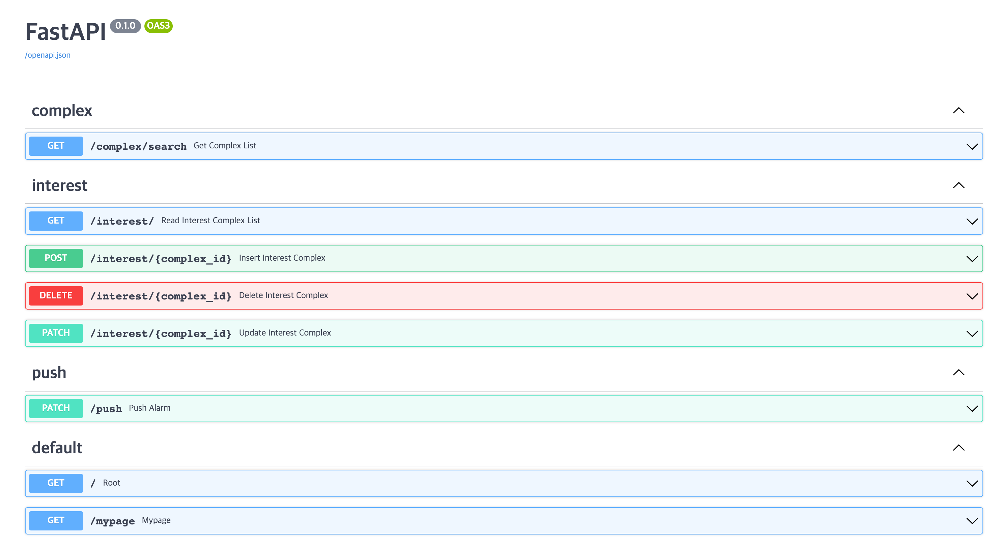
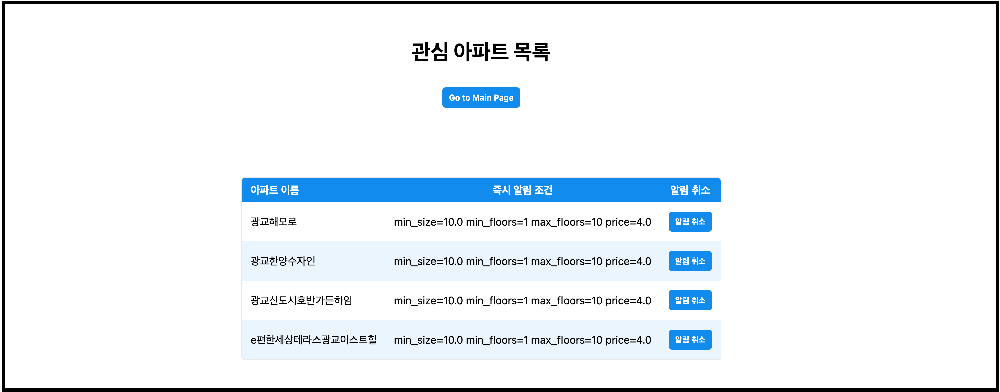
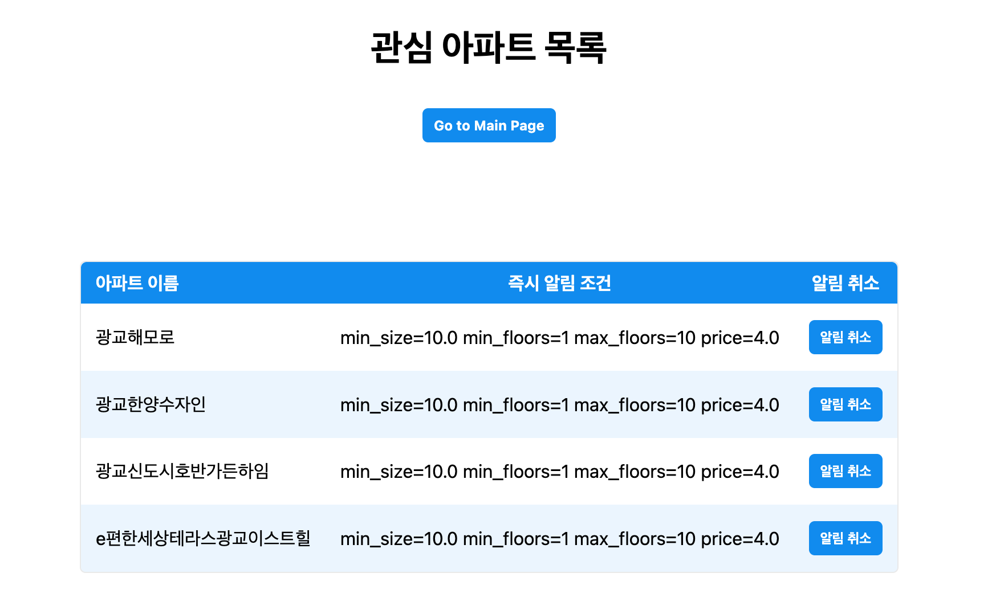
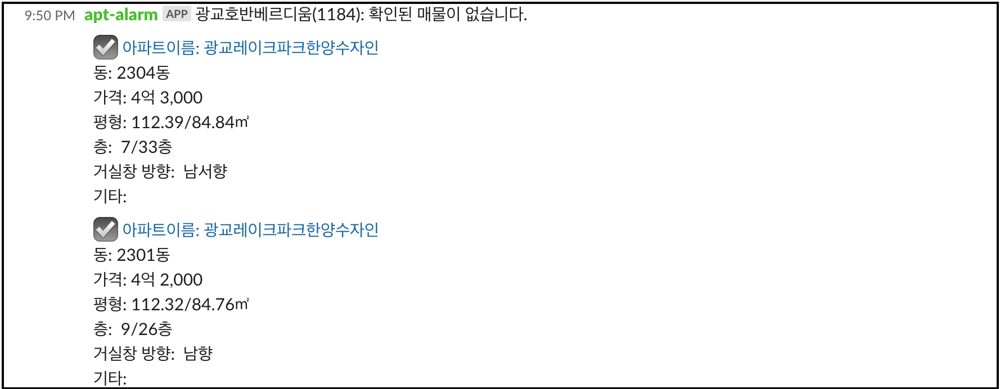

# apt-alarm :: 관심 부동산 알람

이 프로젝트는 부동산 매물 정보를 쉽게 확인하고 싶은 사용자들을 위해 개발된 프로그램입니다.  
사용자는 관심 있는 아파트 단지를 검색하고 해당 단지의 매물 정보를 주기적으로 받아볼 수 있습니다.  
이를 위해 네이버 부동산의 웹 페이지를 스크래핑하여 데이터를 수집합니다.  
정보를 받아보기 위해서는 slack 계정과 채널이 필요합니다.

## Skill-set

- Python
- FastAPI
- REST framework
- selenium
- mongodb
- docker
- Jinja Template

## Run

1. docker 실행
   - docker-compose.yaml 에 YOUR_CHANNEL, YOUR_TOKEN을 자신의 정보로 입력
   - docker build & run
   ```
   $ docker-compose up --build
   ```
2. webrowser(home: http://localhost:8000/) 로 접속

   - 정확한 '동'명 검색  
      ex.
     - 서초구 양재동
     - 영통구 하동
   - 동네별 아파트 단지 중 알림을 원하는 단지 추가
   - mypage에서 알림 취소 / 조건 설정(#TODO)

3. crontab 설정

   - 매일 설정한 시간에 알림 원하는 단지의 정보 제공
   - 새로운 매물 정보는 1시간에 1번 알림
   - [크론탭 설정 방법](documents/crontab.md) 참고

4. api docs 확인가능
   - swagger : http://localhost:8000/docs#/
     

서비스 이미지



